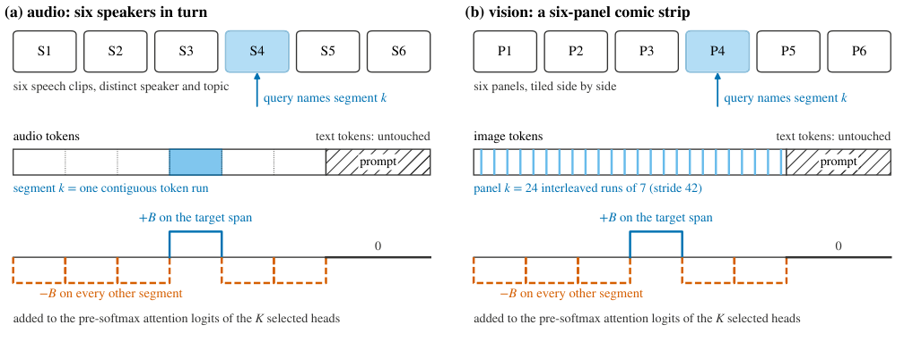

# Inherited Heads

**Audio language models track speakers with their text backbone's attention, and
an attention-mass ranking retrieves a different set**

[Paper (arXiv:2609.14174)](https://arxiv.org/abs/2609.14174) ·
[PDF](https://arxiv.org/pdf/2609.14174) ·
[Citation](#citation)

Bojro Das, Cornell University



## Summary

Asked to describe what one of six speakers in a recording talks about, audio
language models (Qwen2-Audio, Ultravox, SALMONN) describe the right one on only 6 to
16% of trials. Adding a fixed bias to the attention logits of a hundred heads steers
them to the chosen speaker on 90.7% to 99.0% of trials.

- **The heads are inherited.** Heads ranked on each model's text-only language model
  (for Qwen2-Audio, a released model of the same family), with no audio involved,
  steer the audio model on 80.8% to 95.0% of trials. The audio and text head sets
  share 66 to 74 of their top 100 heads, against about 20 by chance.
- **Two attention rankings diverge.** Ranking heads by attention on the segment
  asked about, as a published score does, or by how much of that attention moves
  with the question, gives top hundreds that share 69, 37 and 4 heads across the
  three models. Where they share 4 (Ultravox), the published score's heads leave
  most outputs unattributable to any segment.

## Repository layout

| Path | Contents |
|---|---|
| `experiments/discovery/` | Head ranking, the steering intervention, random controls, the judge, and model adapters |
| `experiments/discovery/results/` | Every run output the paper's numbers come from: head scores, head sets, steering reports and model answers |
| `experiments/RESULTS_LEDGER.md` | Results ledger generated from the run outputs by `discovery/make_ledger.py` |
| `experiments/PREREGISTRATION.md` | Hypotheses and analysis plan fixed before the held-out data |
| `experiments/OUTCOMES.md` | Outcome of every hypothesis and every deviation from the plan |
| `experiments/scripts/` | The scripts each batch of runs was launched with |
| `experiments/testbed/` | Builders for the audio, text and image testbeds, plus label metadata |
| `paper/tex/` | LaTeX source of the paper as submitted to arXiv |
| `paper/figures/make_figures.py` | Regenerates every figure from the results and the ledger |
| `paper/check_numbers.py` | Checks that every number in the paper appears in the ledger |

## Where each result comes from

| Result in the paper | Ledger section | Main code |
|---|---|---|
| Steering with the top-100 heads, and the published score's heads | §3, §25 | `discovery/run_steer.py`, `scripts/run_confirm.sh` |
| Audio and text head-set overlap against a layer-matched null | §1, §2 | `discovery/run_discovery.py`, `discovery/run_text_discovery.py` |
| Heads chosen on text alone steer the audio model | §22 | `scripts/run_h10b.sh` |
| The shared part of the head set is sufficient | §9, §19, §21 | `discovery/make_shared_split.py`, `discovery/make_top100_control.py` |
| The two rankings diverge; unattributable output | §3, §11, §20, §24, §26 | `discovery/make_ledger.py` |
| Random controls vary widely between draws | §11, §19 | `discovery/make_layer_matched.py`, `discovery/make_matched_seeds.py` |
| Where the steered attention comes from; bias strength | §11, §15, §18 | `discovery/measure_rerouting.py` |
| Vision arms, layout transfer, the published Bunny result | §4, §6, §12, §13, §14 | `discovery/run_vlm_discovery.py`, `discovery/run_vlm_steer.py` |

## Pre-registration

The hypotheses, data split, conditions and analysis plan were written on 2026-08-17,
before any held-out data were touched: see
[`PREREGISTRATION.md`](experiments/PREREGISTRATION.md). What happened to each
hypothesis, including the ones that failed, and every change made to the plan are in
[`OUTCOMES.md`](experiments/OUTCOMES.md).

## Reproducing the paper without a GPU

All tables and figures can be rebuilt from the stored run outputs. Python 3.12 with
`numpy` and `matplotlib` is enough.

```bash
# 1. regenerate the results ledger; it should match experiments/RESULTS_LEDGER.md
cd experiments
python discovery/make_ledger.py > /tmp/ledger.md
diff RESULTS_LEDGER.md /tmp/ledger.md

# 2. regenerate the figures into paper/tex/figs/
#    (byte-identical to the committed PDFs with matplotlib 3.11)
cd ..
python paper/figures/make_figures.py

# 3. check every number in the paper against the ledger
python paper/check_numbers.py --strict

# 4. build the paper
cd paper/tex
pdflatex main.tex && pdflatex main.tex
```

## Re-running the experiments

All runs used a single 8 GB RTX 4060 under WSL2. The audio models and Qwen2-VL ran
in 4-bit NF4 with bf16 compute; Bunny ran in fp16.

**Environments.** The audio arms, Qwen2-VL and the text models ran with
transformers 5.x and torch 2.5 in `experiments/.venv`. Bunny's bundled model code
requires transformers 4.37.2, so the Bunny arms run in a separate
`experiments/.venv-bunny`; results from Bunny on transformers 5 are invalid.

```bash
cd experiments
python -m venv .venv && source .venv/bin/activate
pip install -r requirements.txt

# harness check with planted heads, CPU only
python discovery/run_discovery.py --mock
```

**Models** (Hugging Face Hub):

- Audio: `Qwen/Qwen2-Audio-7B-Instruct`, `fixie-ai/ultravox-v0_6-llama-3_1-8b`, and
  SALMONN-13B, which loads `tsinghua-ee/SALMONN` (`salmonn_v1.pth`),
  `openai/whisper-large-v2`, a BEATs checkpoint, and `lmsys/vicuna-13b-v1.1`
  converted to safetensors with `discovery/tools/reshard_to_safetensors.py` (path set
  by `SALMONN_VICUNA_PATH`).
- Text: `meta-llama/Llama-3.1-8B-Instruct`, `Qwen/Qwen1.5-7B-Chat`,
  `lmsys/vicuna-13b-v1.1`, `Qwen/Qwen2-7B-Instruct`, and Bunny's own language model.
- Vision: `Qwen/Qwen2-VL-7B-Instruct`, `BAAI/Bunny-v1_0-3B`.

**Testbeds.**

```bash
# six-speaker LibriSpeech strips: 29.5 s, six 4.5 s segments with 0.5 s gaps
python testbed/build_testbed.py --out testbed/strips --n-items 500 --seed 0

# six-panel comic strips from baulab/openai-comic-strips
python testbed/build_comic_strips.py --n-items 150 --size 448
```

The scripts in `experiments/scripts/` record how each batch was launched. They are
a record rather than a supported entry point: several wait on the previous batch's
log file.

## Errata

The paper (v1) describes the audio strips as 33.5 s long with six 5 s segments, and
its Limitations discuss the sixth segment being cut off by the 30 s encoder window.
That describes an early exploratory version of the testbed. Every reported experiment
used the 29.5 s strips built by `testbed/build_testbed.py` (six 4.5 s segments
separated by 0.5 s of silence), which fit inside the window, so no segment was
truncated. The results are unaffected.

## Data

No audio or images are redistributed. The testbed builders fetch them from their
sources.

- **LibriSpeech** (CC BY 4.0): the audio strips and their text versions.
- **openai-comic-strips** from Bau Lab (MIT): the vision arms. Caption metadata is included.
- **RAVDESS** (CC BY-NC-SA 4.0): the speaker and emotion capability checks. Only
  label metadata is included, under the same license.

## Third-party code

`experiments/discovery/adapters/salmonn_vendor/` contains the BEATs and Q-Former
modules needed to load SALMONN, with their original licenses. `paper/tex/acl.sty`
and `paper/tex/acl_natbib.bst` are the ACL style files.

## AI assistance

As disclosed in the paper, this work was carried out with substantial assistance
from a large language model for code, analysis, literature search and drafting.
Every result comes from runs on the author's own hardware, and every number in the
paper is generated from the stored run outputs in this repository.

## License

Code is released under the MIT License. The paper text and figures are released
under CC BY 4.0, matching the arXiv license. Third-party code and data keep their
own licenses; see [`LICENSE`](LICENSE).

## Citation

```bibtex
@misc{das2026inherited,
  title         = {Inherited Heads: Audio language models track speakers with
                   their text backbone's attention, and an attention-mass
                   ranking retrieves a different set},
  author        = {Das, Bojro},
  year          = {2026},
  eprint        = {2609.14174},
  archivePrefix = {arXiv},
  primaryClass  = {cs.LG},
  doi           = {10.48550/arXiv.2609.14174},
  url           = {https://arxiv.org/abs/2609.14174}
}
```
